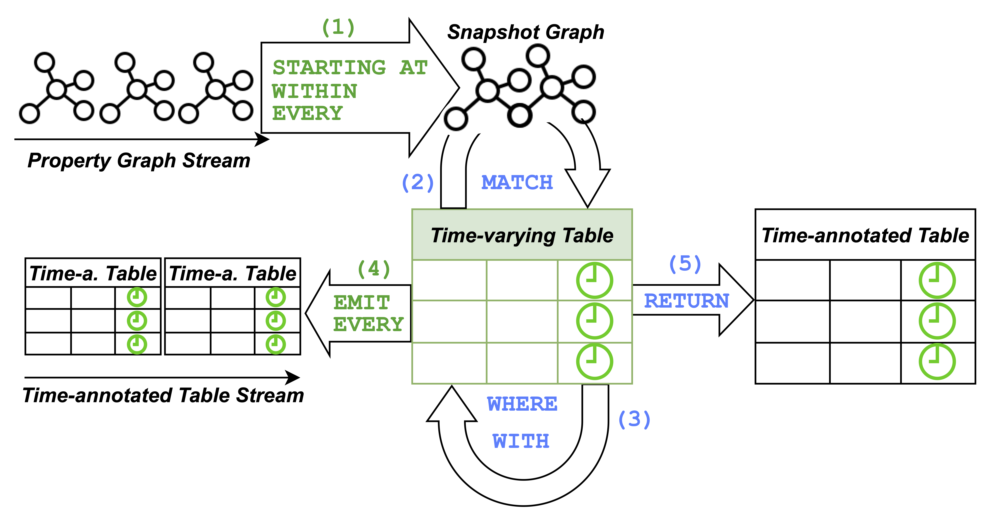
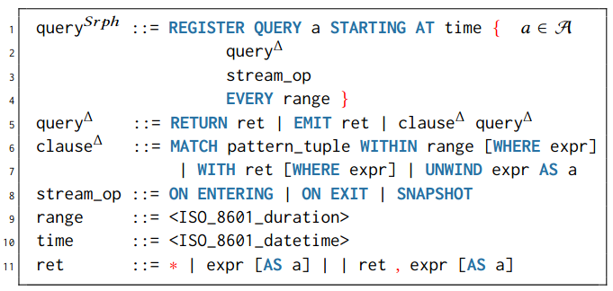
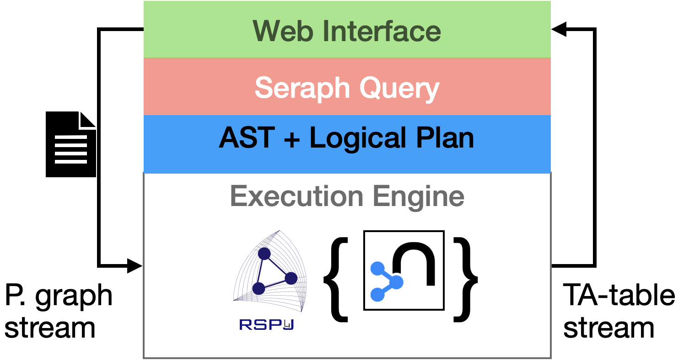
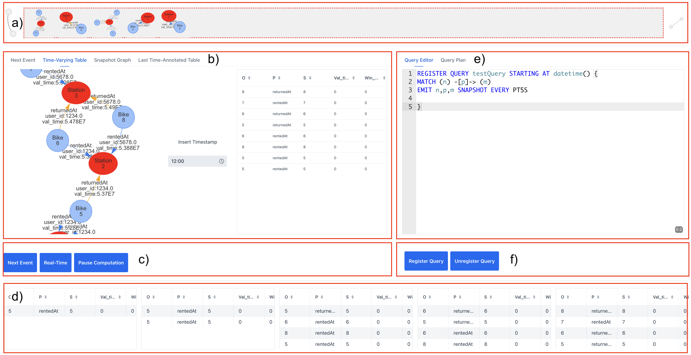

# SERAPH DEMONSTRATION WEBSITE



# A Bit of Documentation

## Query Model



## Syntax

The syntax of Seraph extends the syntax of Cypher 9 as follows:

 

## Architecture



## WEB UI Overview



## Usage example

### Your First Query
```
REGISTER QUERY <query_name> STARTING AT 2019-09-07T15:50:30.022+01:00 {
MATCH (a) - [b] -> (c) WITHIN PT1H WHERE a = 1 OR b = 2
EMIT c
ON EXIT 
EVERY PT10M }
```

### Use Cases


### Bike Sharing


```
REGISTER QUERY student_trick STARTING AT 2022-10-14T14:45 {
MATCH (:Bike)-[r:rentedAt]->(s:Station),
q = (b)-[:returnedAt|rentedAt*3..]-(o:Station)
WITHIN PT1H
WITH r, s, q, relationships(q) AS rels,
[n IN nodes(q) WHERE 'Station' IN labels(n) | n.id] AS hs
WHERE ALL(e IN rels WHERE e.user_id = r.user_id AND e.
val_time > r.val_time AND e.duration < 20 )
EMIT r.user_id, s.id, r.val_time, hs
ON ENTERING EVERY PT5M }
```


#### Network Monitoring
```
REGISTER QUERY anomalous_routes STARTING AT datetime() {
MATCH path = allShortestPaths(
(rack:Rack)-[:HOLDS|ROUTES|CONNECTS*]-(r:Router:Egress))
WITHIN PT10M
WITH rack, avg(length(path)) as 10minAvg, path
WHERE (10minAvg - 5 / 0.5) >= 3
EMIT path
SNAPSHOT EVERY PT1M 
```


#### Crime Investigation


 {
MATCH (call:Event)-[:OCCURRED_AT]->(l:Location)
WITHIN PT15M
WITH call, point(l) AS crime_scene
MATCH (crime:Event)<-[:PARTY_TO]-(p:Suspect)-[:NEAR_TO]->(curr:Location)
WITHIN PT15M
WITH call, crime, p, curr,
distance(point(curr), crime_scene) AS distance
WHERE distance < 3000 AND call.type=crime.type
EMIT person, curr, call.description
SNAPSHOT EVERY PT5M 
```

## License

Licensed under the [Apache License, Version 2.0](https://www.apache.org/licenses/LICENSE-2.0).
